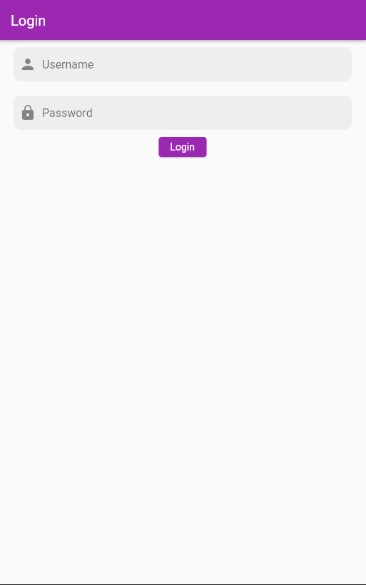
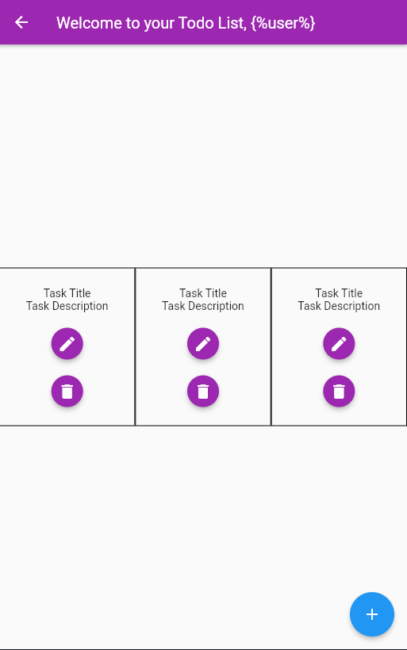

# Ponderada 2

Desenvolvimento Aplicativo Mobile

## Features
- Telas de Login e visualização de tarefas utilizando flutter e dart.

## Arquitetura


import { Aside } from '@astrojs/starlight/components';

<Aside>A estrutura de pastas do projeto flutter: </Aside>

import { FileTree } from '@astrojs/starlight/components';

<FileTree>

- ponderada2
    - analysis_options.yaml
    - android
    - build
    - ios
    - lib
        - main.dart
        - todo.dart
    - linux
    - macos
    - ponderada2.iml
    - pubspec.lock
    - pubspec.yaml
    - README.md
    - test
    - web
    - windows

</FileTree>

## Execução

Para executar o projeto, siga os seguintes passos:

import { Steps } from '@astrojs/starlight/components';

<Steps>

1. Clone o repositório:

    ```bash
    git clone https://github.com/Inteli-EC-Kikuchi/ponderadas-m10.git
    ```

2. Entre na pasta do projeto:

    ```bash
    cd ponderadas-m10/ponderada2/ponderada2
    ```

3. Lançar o emulador ou conectar o dispositivo físico.

    ```bash
    flutter emulators --launch <device_name>
    ```

4. Execute o comando:

    ```bash
    flutter run
    ```

</Steps>

## Telas

<Aside type="caution" title="Watch out!">
    As telas ainda estão em desenvolvimento.
    Todas as informações estão mockadas. A integração com a API acontecerá em breve! 
</Aside>

### Tela de Login
<center></center>

### Tela de Tarefas
<center></center>